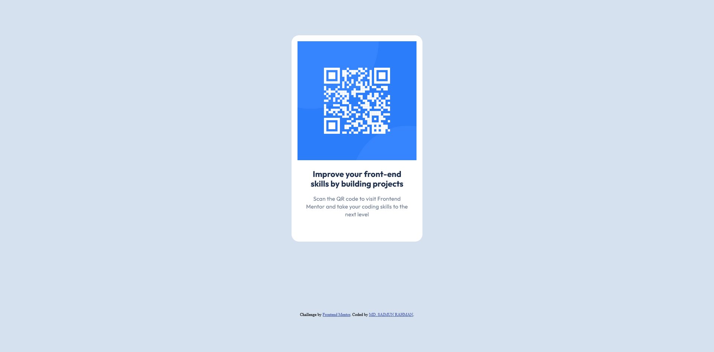

# Frontend Mentor - QR code component solution

This is a solution to the [QR code component challenge on Frontend Mentor](https://www.frontendmentor.io/challenges/qr-code-component-iux_sIO_H). Frontend Mentor challenges help you improve your coding skills by building realistic projects.

## Table of contents

- [Overview](#overview)
  - [Screenshot](#screenshot)
  - [Links](#links)
- [My process](#my-process)
  - [Built with](#built-with)
  - [Useful resources](#useful-resources)
- [Author](#author)

## Overview

### Screenshot

### Links

- Solution URL: [Frontend Mentor](https://www.frontendmentor.io/solutions/responsive-qr-code-component-8OysU3WfVi)
- Live Site URL: [Live Site](https://qr-code-component-tau-mauve.vercel.app/)

## My process

### Built with

- Semantic HTML5 markup
- CSS custom properties
- Flexbox
- Mobile-first workflow

### Useful resources

- [Google Font](https://fonts.google.com/specimen/Outfit) - This helped me to implement required fonts into this project.
- [CSS Custom Properties](https://www.geeksforgeeks.org/what-are-css-custom-properties/) - This helped me to gain perfect understanding of Custom CSS Properties and work with it.

## Author

- Website - [Add your name here](https://www.your-site.com)
- Frontend Mentor - [@iamsaimun](https://www.frontendmentor.io/profile/iamsaimun)
- Twitter - [@yourusername](https://www.twitter.com/yourusername)
